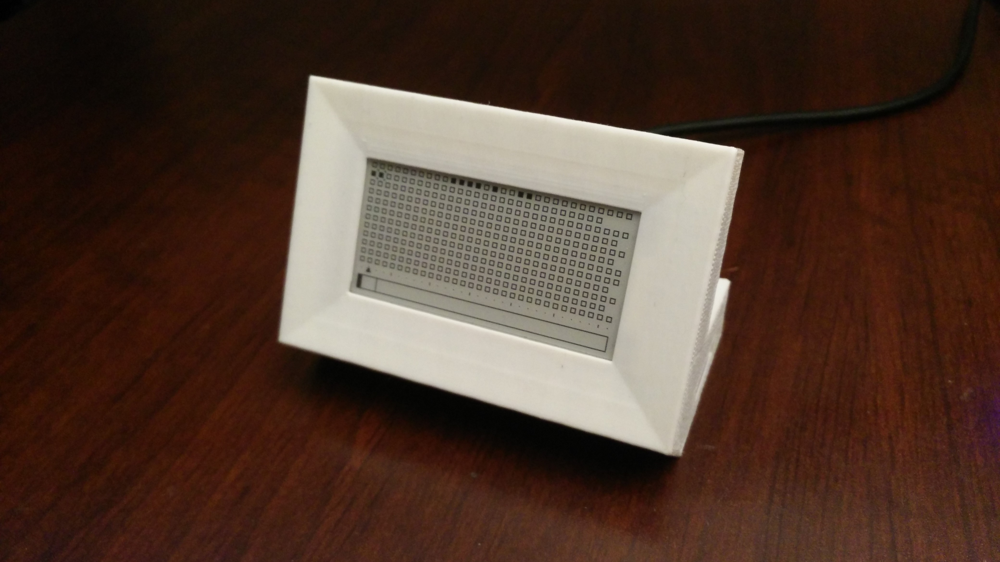

# junk's COMBO MAKER

The COMBO MAKER is a small every day calandar counter for your desktop, inspired by the likes of Simone Giertz's [Everyday Calendar](https://www.youtube.com/watch?v=-lpvy-xkSNA).



## Materials
+ Raspberry PI Zero WH
+ Waveshare 2.13" e-paper HAT

## Installation

### Raspberry Pi OS Lite

We'll be using the smallest version of Raspberry Pi OS we can, setting up SSH and connecting it to the local wireless network.

<details open><summary><b>Hide/Show Instructions</b></summary>
  
  1.  Use the [Raspberry Pi Imager](https://www.raspberrypi.org/software/) to flash Raspberry Pi OS Lite onto the PI Zero's SD card.
  2.  Open the `boot` folder and create a new file named `ssh`. This will automatically enable SSH.
  3.  In the `boot` folder, create a new file named `wpa_supplicant.conf`. Edit the file and add the following:
      ```
      country=<ENTER TWO-LETTER COUNTRY CODE>
      ctrl_interface=DIR=/var/run/wpa_supplicant GROUP=netdev
      update_config=1

      network={
      ssid="NETWORK-NAME"
      psk="NETWORK-PASSWORD"
      }
      ```

  4.  Connect the PI Zero to power, it's time to SSH into it. You can do this using PowerShell with the `ssh` command:
      ```
      ssh pi@raspberrypi
      ```
      The default password for the `pi` user is `raspberry`.
      You may get a warning about permanently adding the PI to your hosts file, type `yes` when prompted.
      Once in, we'll change some system settings through the build in config menu:
      ```
      sudo raspi-config
      ```
      We will need to
        + Update Configuration Tool
          + Update
        + Change the default password
          + System Options > Password
        + Change the default hostname
          + System Options > Hostname
        + Enable SPI
          + Interface Options > SPI > Yes
        + Change the timezone
          + Localisation Options > Timezone

      Select `Finish`, this will require a reboot once completed.
      Note: You'll want to use the new hostname and password you entered to SSH into your PI.
      After that, we'll go through the regular housekeeping after install:
      
      ```
      sudo apt-get update && sudo apt-get upgrade && sudo reboot
      ```
      
      That marks the Pi Zero ready to be worked on!
  
</details>

### Install Modules & More

We'll need to install a couple things in order to get the project working.

<details open><summary><b>Hide/Show Instructions</b></summary>
  
  1.  Install Python Libraries
  
      ```
      sudo apt install python3-pip
      sudo pip3 install Pillow RPI.GPIO spidev (DO I NEED PILLOW?)
      ```
      
  2.  Install git & more
  
      ```
      sudo apt-get install git python3-pil python3-numpy libopenjp2-7
      ```
  
</details>

### Clone This Repo

<details open><summary><b>Hide/Show Instructions</b></summary>
  
  1.  Change your directory by typing `cd` and pressing enter.
  
  2.  Clone this repo with this command:
  
      ```
      git clone https://github.com/junk-shop/combo-maker/
      ```
      
  3.  Move the folder we need and delete the rest (we really just need a way to clone just the subdirectory without the extra files, but this will do for now...)
  
      ```
      mv /home/pi/combo-maker/pi-zero-w /home/pi && rm -rv /home/pi/combo-maker
      ```
  
    
</details>

### Schedule Scripts to Run at Boot

<details open><summary><b>Hide/Show Instructions</b></summary>
  
  1.  Edit the `rc.local` file:
  
      ```
      sudo nano /etc/rc.local
      ```
  
  2.  Add the commands to run the scripts at startup:
  
      ```
      add the commands here
      this line too
      ```
      
</details>
